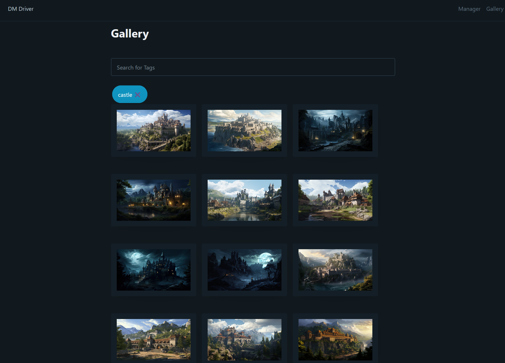

# DM Driver
A loading screen for the flustered DM.

## Background
I recently build a DM screen with a player-facing monitor which I use to show them handouts, character art and an initiative tracker. In order to do this in a smooth and streamlined way, I use my laptop running OBS which sends a fullscreen preview to the second monitor. 

It's a hassle changing the source images in OBS, and I really couldn't be bothered learning the OBS scripting interface. I reaslised that I could just host a local website, point OBS to the website and use that as the background. 

Thus, this project was born.

## Technical details
This is a flask app with an sqlite backend (via SQLAlchemy and Alchemical) which interfaces a local directory full of images. I purposefully didn't make the flask app manage the directory, rather only keeping track of file names. 

The images are stored as filenames in a database, along with their dimensions and a rudimentary hash (which will probably need to be updated). 

Tags are applied to images via a many-to-many relationship. Searching by a list of tags returns a list of images sorted by the number of matching tags. 

The 'loading' and 'backdrop' screens show a random image and a random message. You can supply an image_id or a message_id via the image or message url parameter and then it will be fixed instead.

Sessions have a fixed url (e.g., /loading?session=1) and fix an image and a message. This is what OBS points to, so I can change the image/message that is linked to the session and, on reload, OBS will show a different screen without updating the URL. 

## Usage
Clone the repository then run the development server. I use 
    > flask run --host=0.0.0.0

Please don't use this outside of a local network that you trust. 

## Features

Loading screen, with animated background and digital-RPG-style messages. The backdrop is the same, without the loading spinner and the message of the day

Gallery to select images by tag

Manager to tag images

## ToDo
Honestly, this is a rough first draft. Lots of bugs, lots of features to implement. Watch this space. Changes will be breaking, so download at your own risk.
- [ ] Support multiple image directories
- [ ] Support image hashing to detect duplicates, moved images, similar images etc
- [ ] Properly implement sessions
- [ ] Force OBS reload, maybe via websockets?

## Disclaimer
I'm untrained in all aspects of this, so there are lots of bad practices here. There is zero security built in, and this app will have full run of your system so use at your own risk. 